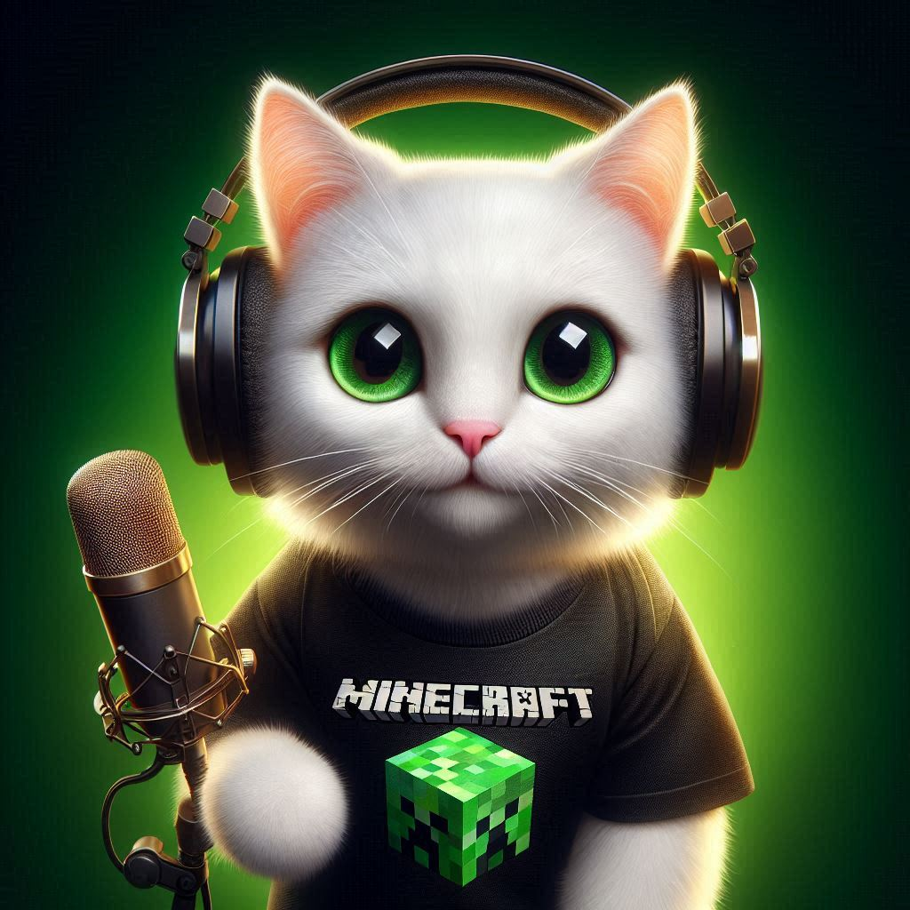

# Code, Craft and Meow 🐈

    

Este projeto teve como objetivo fazer um podcast utilizando Inteligências Artificiais (IAs).

## 🖱️ Como acessar?
1. Abra a pasta 'video'
2. Abra o conteúdo .mp4

## 💻 Tecnologias utilizadas no projeto

- [ChatGPT](https://chat.openai.com/) - para título e conteúdo
- [Copilot](https://copilot.microsoft.com) - para gerar imagens
- [Eleven Labs](https://elevenlabs.io) - para gerar o arquivo de áudio

## 📄 Prompts e ferramentas

**ChatGPT：**

|   Ação   | prompt                                                                                                                                                                                                                                                                         |
| :------: | ------------------------------------------------------------------------------------------------------------------------------------------------------------------------------------------------------------------------------------------------------------------------------ |
|  título  | Crie 10 ideias para o nome de um podcast que misture elementos de minecraft com programação front end|
| conteúdo | Você é roteirista de um podcast chamado "Craft, Code and Meow", que fala principalmente de desenvolvimento front-end, mas o apresentador é um gato branco muito fã de minecraft. O público alvo desse canal é principalmente desenvolvedores iniciantes que gostam de games. Você deve criar um roteiro para esse podcast cujo modelo deve ser: {INTRODUÇÃO} {CURIOSIDADE 1} {CURIOSIDADE 2}{CONCLUSÃO}. {REGRAS} - No bloco de {INTRODUÇÃO} inicialize o podcast utilizando falas bem coloquiais e legais, entre no personagem descrito; - No bloco de {CURIOSIDADE 1}, substitua por uma curiosidade de CSS; - No bloco de {CURIOSIDADE 2}, fale sobre uma ferramenta útil para o desenvolvimento front-end; - No bloco {CONCLUSÃO}, faça uma despedida bem cool e marcante; - use termos fáceis; - o podcast vai ser curto, cerca de 4 minutos; - não use muitos termos técnicos díficeis; - o podcast vai ser apresentado pelo gato Meow |

**Copilot:**

* **Observação:** a fim de obter um melhor resultado, o prompt foi feito em inglês.

|   Ação   | prompt                                                                                                                                                                                                                                                                         |
| :------: | ------------------------------------------------------------------------------------------------------------------------------------------------------------------------------------------------------------------------------------------------------------------------------ |
|  imagem | generate a image of a white cat with big eyes wearing a green minecraft t-shirt, holding a microphone and wearing black headphones. The image's background must contrast with the main character. Plese, try to do a funny image and use a realistic style (please, try don't do a scary image)|

## 🛠️ Instruções de execução

Utilize os prompts acima nas ferramentas sugeridas para gerar o material base e utilize uma ferramenta de edição vídeo para unir a imagem e o áudio.

---

⌨️ com 💜 por [Dani](https://github.com/danielle-soaress)
